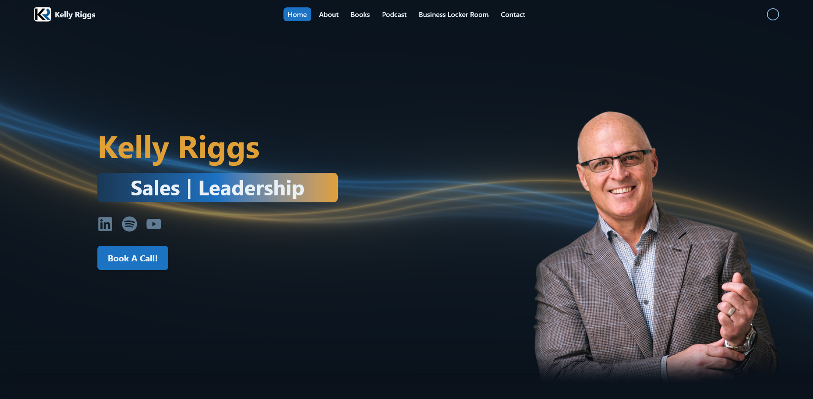

<p align="center">
<a href="https://themelab.stefischer.com"></a>
</p>

<h1 align="center">Kelly Riggs</h1>

<p align="center">A website for the author / sales leader / keynote speaker Kelly Riggs!</p>

<p align="center">
    </img>
    </img>
</p>

<p align="center">
  <a href="#how-to-run">How To Run</a> •
  <a href="#technologies-used">Technologies Used</a> •
  <a href="#license">License</a>
</p>



### How To Run

- Install [bun](https://bun.sh/docs/installation#installing)
- At the root of the repository run
```bash
bun install
```
- To start the development server run
```bash
bun dev
```

### Technologies Used


### License

None

---

Made with ☕️ by [Stefan Fischer](https://stefischer.com)